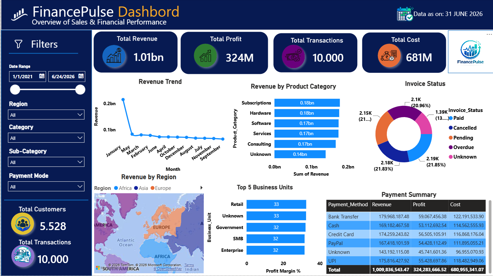

💹 FinancePulse Data Analysis

A comprehensive Financial Data Analysis project developed using Python, Pandas, NumPy, MySQL, Matplotlib, Seaborn, and Power BI. The project analyzes financial transaction data to generate meaningful business insights through interactive visualizations, statistical analysis, and key performance indicators (KPIs).

  

📌 Project Overview

This project provides a comprehensive analysis of financial transactions using Python, SQL, and Power BI. It enables users to explore Revenue, Profit, Cost, Business Unit Performance, Product Categories, Payment Methods, Customer Ratings, and Regional Performance through interactive dashboards.

The project demonstrates:

🧹 Data Cleaning

🔄 Data Preprocessing

📊 Exploratory Data Analysis (EDA)

🗄 SQL Analysis

📈 Data Visualization

⚙️ Data Modeling

📉 Power BI Dashboard Development

✨ Features

💰 Revenue Analysis

📈 Profit Analysis

💸 Cost Analysis

🔢 Total Transactions

👥 Total Customers

📅 Revenue Trend Analysis

📦 Revenue by Product Category

🌍 Revenue by Region

🏢 Top Business Unit Analysis

💳 Payment Method Analysis

🧾 Invoice Status Analysis

⭐ Customer Rating Analysis

🎛 Interactive Filters & Slicers

📌 Dynamic KPI Cards

🛠 Technologies Used

Python

Pandas

NumPy

MySQL

Matplotlib

Seaborn

Power BI Desktop

Power Query

DAX (Data Analysis Expressions)

CSV Dataset

🗂 Dataset

The project is built using a financial transaction dataset containing sales, profit, cost, customer, and business information.

Dataset Includes

Transaction Details

Revenue

Profit

Cost

Business Unit

Department

Product Category

Region

Country

Payment Method

Invoice Status

Customer Rating

Operating Expense

ROI

Risk Score

Forecast Accuracy

Fiscal Year

Employee Information

📂 Dataset Location

FinancePulse_Analytics_Dataset_cleaning.csv

🖥 Dashboard Preview

  

📊 Business Insights

Compared revenue and profit across different business units.

Identified top-performing product categories.

Analyzed regional financial performance.

Evaluated payment method distribution.

Monitored invoice status and customer ratings.

Tracked overall financial performance using KPI cards.

📁 Project Structure

FinancePulse-Data-Analysis/
│
├── FinancePulse.pbix
├── FinancePulse.ipynb
├── financepulse_queries.sql
├── FinancePulse_Analytics_Dataset_cleaning.csv
├── financepulse.PNG
├── README.md
└── LICENSE

🚀 How to Use

Clone or download this repository.

Open FinancePulse.ipynb in Jupyter Notebook.

Run the notebook for data cleaning and EDA.

Import the dataset into MySQL and execute financepulse_queries.sql.

Open FinancePulse.pbix using Power BI Desktop.

Refresh the dataset if required.

Explore the interactive dashboard.

🎯 Skills Demonstrated

Data Cleaning

Data Preprocessing

Exploratory Data Analysis (EDA)

Statistical Analysis

SQL Queries

Data Transformation

Data Modeling

Power Query

DAX Calculations

Business Intelligence

Data Visualization

Dashboard Design

👨‍💻 Author

Bijoe Shane

GitHub: https://github.com/bijoe-byte

📄 License

This project is licensed under the MIT License.
